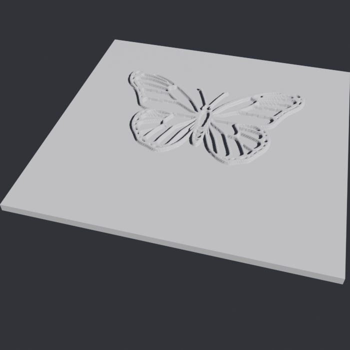
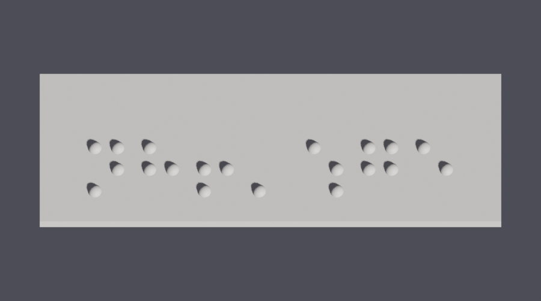

# Tactile teaching-plate generator

Turn an **idea** (and/or a **reference image**) into a 3D-printable **tactile relief
plate** for blind learners — plus standard-spaced **braille labels**.

<p align="center">
  
  
</p>

```
idea / image ──► bold B&W picture ──► height map ──► embossed solid ──► .stl
              (Pollination)         (Pillow)        (Blender displace)
```

* **Pollination** *generates* the line drawing from a text prompt.
* **Gemini** *reads* a reference image and describes it, so Pollination can redraw it
  as a clean tactile version (Pollination can't accept image uploads — Gemini bridges
  the gap).
* **Blender** applies a Displace modifier to a subdivided plane, then builds a
  watertight, **flat-bottomed** solid (relief on top, flat base underneath → prints
  flat-side-down, no supports).

It also includes **`src/braille.py`** — a standard-spaced braille / 盲文 / 点字 label
generator (English + 中文国家通用盲文) — and **`src/gui.py`**, a simple graphical interface.

## Install

```bash
git clone <this-repo-url>
cd tactile

python3 -m venv .venv && source .venv/bin/activate   # or reuse an existing venv
pip install -r requirements.txt                      # pillow numpy requests google-genai pypinyin

cp .env.example .env                                 # then put your real API keys in .env
```

External tools (not pip):
* **Blender** — for the picture-relief STL. macOS default path `/Applications/Blender.app/...`
  is auto-detected; override with `$BLENDER`. (Not needed for braille labels.)
* **liblouis** — for braille translation: `brew install liblouis` (gives `lou_translate`).

API keys (free): [Pollinations](https://pollinations.ai) for image generation,
[Google AI Studio](https://aistudio.google.com/apikey) for Gemini image reading.

## Project structure

```
tactile-braille-maker/
├── run_gui.command          # double-click launcher (macOS) → src/gui.py
├── requirements.txt
├── .env.example             # copy to .env and add your keys (.env is git-ignored)
├── docs/                    # preview images for this README
├── out/                     # generated STLs (git-ignored)
└── src/
    ├── env.py               # shared: paths, .env loading, interpreter resolver
    ├── relief.py            # idea/image → B&W → Blender displace → relief STL
    ├── braille.py           # text → liblouis → standard-spaced braille STL
    ├── blender_displace.py  # headless Blender step (run by Blender, not python)
    ├── batch.py             # batch over a text list, or a folder of images
    ├── gui.py               # tkinter 3-tab GUI (relief / braille / batch)
    ├── pdf_analyze.py       # Gemini: PDF → worklist (titles, pages, labels, notes)
    ├── pdf_extract.py       # PyMuPDF: PDF → figure PNGs (local, no API)
    └── pdf_make.py          # crop PDF figures → faithful relief + in-place braille
```

Every script is runnable on its own (`python src/<name>.py -h`); they call each other by
path and share `src/env.py`. The GUI just orchestrates them.

## GUI

Easiest: **double-click `run_gui.command`** (it launches with the correct Python).

Or from a terminal:

```bash
~/gemini-tex/.venv/bin/python src/gui.py     # the venv that has the deps
# (if you launch it with another Python, subprocesses still auto-find the venv;
#  override with the TACTILE_PYTHON env var if your venv is elsewhere)
```

A three-tab window:
* **图片浮雕板** — type an idea (and/or pick a reference image), set size / precision (mm) /
  style (line vs grayscale relief), hit generate; shows the height-map preview, writes the STL.
* **盲文标签** — type text, choose the braille scheme (国家通用盲文 by default), with a
  **live dot preview**; generate writes the STL.
* **批量** — paste a list (one item per line), pick mode (picture / braille / both), and
  generate them all at once. See below.

## Batch (批量) — for educators making many items

```bash
python src/batch.py words.txt --mode both --size 120 --lang auto      # or --mode picture / braille
```

`words.txt` is one item per line; an optional `|` separates the picture idea from the braille
label (so an English-drawn picture can carry a Chinese label). Output goes to
`out/batch_<timestamp>/`, with picture and braille files named so they pair up.

```
butterfly | 蝴蝶
a maple leaf | 枫叶
sun | 太阳
# lines starting with # are ignored
```

### From a PDF (Gemini builds the worklist)

Point it at a PDF (e.g. a textbook chapter or a curated figure list) and Gemini extracts
every image/diagram to make, as a ready-to-edit worklist:

```bash
python src/pdf_analyze.py 选图.pdf                 # -> 选图.worklist.txt (+ .json with pages/labels/notes)
python src/batch.py 选图.worklist.txt --mode both  # then generate them
```

In the GUI **批量** tab, click **📄 从 PDF 分析**, pick the PDF, review/trim the auto-filled
list, then **📦 批量生成**. Each line is `description | 中文标题`.

**Two ways to make each picture** (图片做法 selector / `src/pdf_make.py`):
* **重画 (redraw)** — Pollination draws a clean tactile diagram from the description; the title
  becomes the braille label. Best for simple shapes.
* **抠原图 (extract)** — render the PDF page, crop the actual figure (`box_2d` from the analysis),
  and emboss it directly with its own labels turned to braille **in place**. Faithful to the
  textbook diagram. CLI:

```bash
python src/pdf_make.py 选图.pdf 选图.worklist.json --size 160        # extract + in-place braille
python src/pdf_make.py 选图.pdf 选图.worklist.json --no-braille       # figure only
```

> **Gemini quota:** the free tier allows ~20 requests/day. PDF analysis is 1 request, but the
> 抠原图 braille step is 1 request per figure, so large batches can hit the cap (calls retry with
> backoff, and a figure still prints without braille if its detection fails). Enable billing on the
> API key for big runs — or use the **local, no-API** path below.

### Fully local — no API, no quota (recommended for big batches)

Extract the figures straight out of the PDF with PyMuPDF (no API), curate the folder, then
batch them — make as many variants as you like:

```bash
python src/pdf_extract.py 选图.pdf                       # -> 选图_figures/  (one PNG per figure)
# delete unwanted files, rename them to 中文标题 (the filename becomes the braille label)
# one plate per figure, with the figure's own text turned to braille in place:
python src/batch.py --images 选图_figures --mode picture --braille-text --text-engine tesseract
python src/batch.py --images 选图_figures --variants line,relief   # or: 2 style versions each
```

In the GUI **批量** tab: **📁 PDF→图片(本地)** extracts locally and opens the folder; after you
tidy it, click **📦 批量生成** (图片做法 = 本地文件夹). By default each item makes **one plate**
with **把图中所有文字转成盲文（就地）** ticked, so the figure's labels are embossed as braille on
the same plate. Pick the **盲文OCR** engine: *云端 Gemini* (accurate, uses quota) or *本地 Tesseract*
(offline, weaker on small/CJK labels). Braille *labels* (`src/braille.py`) are always local.

## Usage (command line)

```bash
PY=~/gemini-tex/.venv/bin/python      # has pillow / numpy / google-genai
cd ~/Desktop/盲人教案/tactile

# from an idea
$PY src/relief.py --idea "a butterfly"
$PY src/relief.py --idea "the water cycle: sun, cloud, rain arrows, ground"

# from a reference image (Gemini describes it, Pollination redraws it tactile)
$PY src/relief.py --image ~/photo.jpg
$PY src/relief.py --idea "make it simpler" --image ~/photo.jpg

# use an image you already cleaned to black-and-white, skip generation
$PY src/relief.py --image ~/clean_bw.png --use-image-directly

# control the physical plate
$PY src/relief.py --idea "a maple leaf" --size 150 --base 2.5 --relief 1.8 --out ~/leaf.stl
```

STLs land in `out/` by default. `--keep` saves the generated picture + height map too.

The plate **keeps the image's aspect ratio** — `--size` is the *longer* side and the
shorter side follows the picture, so the relief is never squished.

## Key options (`src/relief.py -h` for all)

| flag | default | meaning |
|------|---------|---------|
| `--size` | 120 | **longer** plate side (mm); shorter side follows the image aspect |
| `--base` | 3.0 | solid base thickness (mm) |
| `--relief` | 1.5 | max raised height (mm) |
| `--res` | 600 | subdivisions along the longer side (higher = finer/slower) |
| `--precision` | — | **target detail in mm/vertex** (overrides `--res`; clamped to ≤2000 subdiv). 0.001mm is impossible — printers resolve ~0.1mm FDM / ~0.05mm resin |
| `--style` | line | `line` = black/white line art (flat-topped relief) · `relief` = **grayscale bas-relief with varying depth** |
| `--braille-text` | off | detect image text and emboss it as braille (国家通用盲文/English) instead of glyphs |
| `--threshold` | 128 | binarize cutoff 0–255; `-1` = keep smooth grayscale relief |
| `--thicken` | 2 | widen raised lines by N px so fingers can feel them |
| `--blur` | 1.0 | edge smoothing (printability) |
| `--margin` | 0.06 | flat border fraction around the relief |
| `--no-invert` | — | use when the subject is already light-on-dark |
| `--seed` | 42 | generation seed (change to get a different drawing) |

## Tips for good tactile output

* **Keep ideas simple and bold.** "a butterfly" reads far better by touch than a busy
  scene. Fingers resolve ~1–2 mm, so avoid fine detail.
* If lines feel too thin, raise `--thicken` (e.g. 4) or `--size`.
* If a drawing comes out cluttered, change `--seed` or add words like
  "very simple, minimal detail, few thick lines" to `--idea`.
* `--relief 2.0` gives a stronger, easier-to-feel bump; `--base` 2.5–3 mm keeps it rigid.

## Config

API keys live in `~/Desktop/盲人教案/tactile/.env` (`POLLINATIONS_TOKEN`, `GEMINI_API_KEY`); env vars
override. Blender path defaults to the macOS app bundle — override with `$BLENDER`.

---

# Braille labels (`src/braille.py`)

Standard-spaced raised **braille / 盲文 / 点字** dots → printable STL. No AI: text is
translated by **liblouis** (industry-standard tables) and the dots are built directly at
the official spacing. Print **dots-up** (flat side on the bed); reads left-to-right.

```
text ──► liblouis ──► Unicode braille cells ──► dome dots on a plate ──► .stl
```

## Usage

```bash
PY=~/gemini-tex/.venv/bin/python
cd ~/Desktop/盲人教案/tactile

$PY src/braille.py "Cat"                    # English Grade 1
$PY src/braille.py "你好世界"                 # 中文 国家通用盲文 (auto-detected)
$PY src/braille.py "猫 cat"                   # mixed Chinese + English, one pass
$PY src/braille.py --lang en-g2 "the cat"    # English Grade 2 (contracted)
$PY src/braille.py --lang zh-current "你好"   # 现行盲文 instead of 国家通用
$PY src/braille.py "EXIT\n出口"               # two rows (\n)
$PY src/braille.py --braille "⠉⠁⠞"           # supply Unicode braille directly
$PY src/braille.py --dots "14 1 2345"        # supply explicit dot numbers per cell
$PY src/braille.py "Exit" --size 80 --base 2.5   # centre on a fixed 80mm-wide plate
```

## Languages (`--lang`, default `auto`)

| value | table | meaning |
|-------|-------|---------|
| `auto` | — | CJK present → `zh`, else `en` |
| `en` | en-us-g1 | English uncontracted (Grade 1) |
| `en-g2` | en-us-g2 | English contracted (Grade 2) |
| `zh` | zhcn-cbs | 中文 国家通用盲文 (2018), also passes Latin through |
| `zh-current` | zh-chn | 中文 现行盲文 |
| `zh-toned` | zhcn-g1 | 中文 现行盲文，逐字标调 |

Any other value is passed straight to liblouis as a table name.

## Standard geometry (override only with reason)

| flag | default | spec |
|------|---------|------|
| `--dot-spacing` | 2.5 mm | dot centres within a cell |
| `--cell-pitch` | 6.0 mm | cell-to-cell (dot 1 → dot 1) |
| `--line-pitch` | 10.0 mm | line-to-line (dot 1 → dot 1) |
| `--dot-diam` | 1.5 mm | dot base diameter |
| `--dot-height` | 0.6 mm | dot height above the plate |
| `--base` | 2.0 mm | base plate thickness |
| `--margin` | 6.0 mm | edge-to-nearest-dot margin |
| `--size` / `--height` | auto | fix plate W/H (mm); text is centred |

Use `--size`/`--height` to match a picture plate from `src/relief.py`, then the label can be
printed beside or below the relief image.

